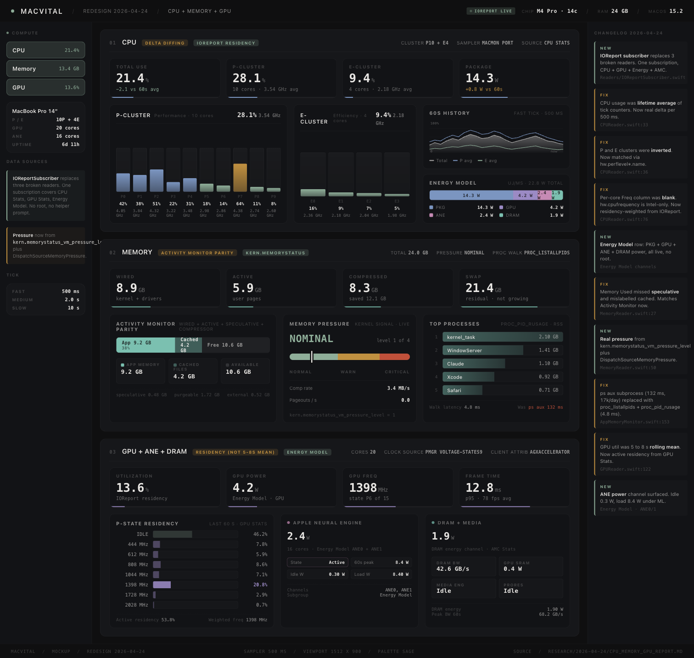
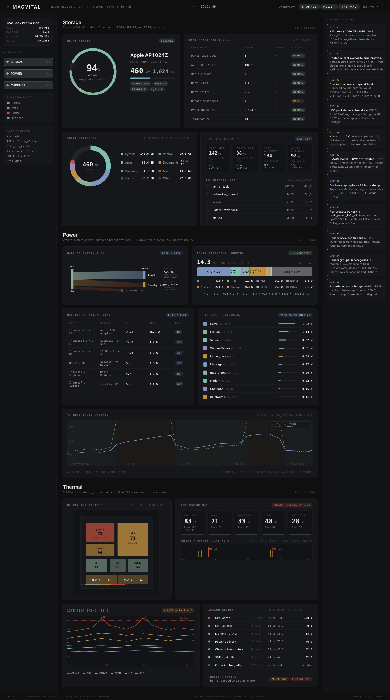
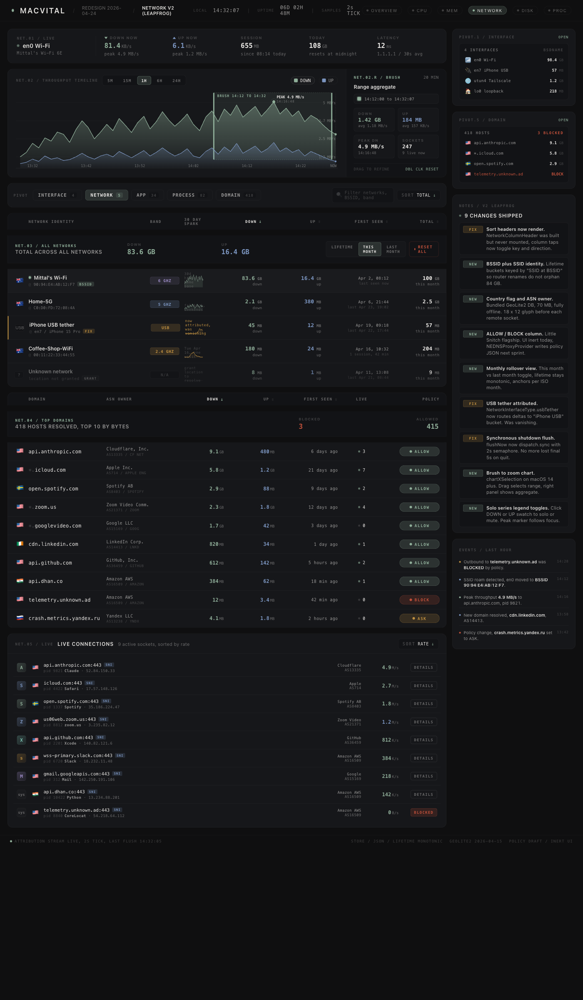
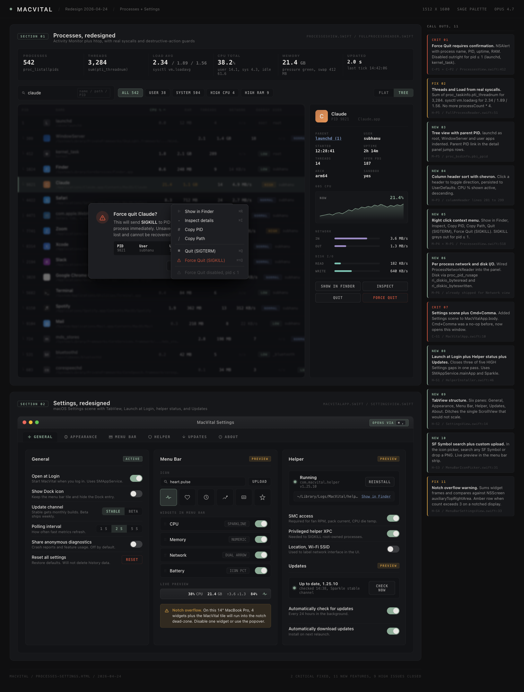
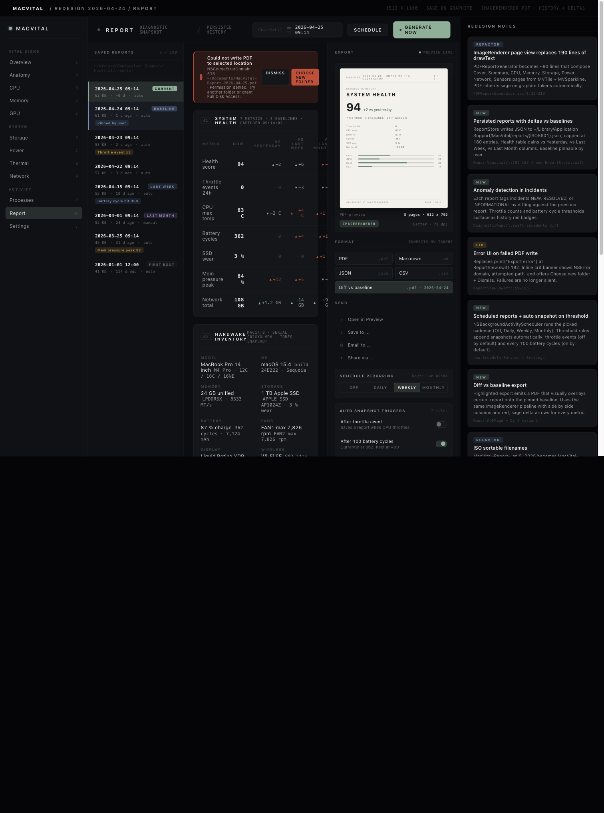

# MacVital

A native macOS health-monitoring and diagnostic app for Apple Silicon Macs.
Every sensor, every counter, every wattage rail, surfaced in one app, no
hidden summaries, no agglomerated "health scores" with no methodology.

The goal: a tool that looks and behaves like a real instrument, not a generic
dashboard template. Sankey power flow, per-rail SMC reads, SMART attribute
tables with explanations, native menu-bar widgets that follow the macOS HIG.

## Screenshots











## Features

- **Real-time monitoring** for CPU, memory, GPU, storage, battery, sensors, power, network
- **Native menu bar widgets** with a multi-module Stats-style architecture; 8 icon styles, palette-themed values
- **Power tab** with per-rail wattage (CPU, GPU, DRAM, ANE, ISP, backlight, etc.), Sankey delivery flow, thermal callouts
- **SMART diagnostics** with the full NVMe SMART attribute table and plain-English explanations
- **Network** with per-app / per-domain / per-SSID byte counters, persistent across reboot
- **Health metrics, exposed** so every raw value the helper reads is visible somewhere in the UI; no black-box scores
- **Reports** for full diagnostic export as PDF or HTML
- **Privacy** runs entirely on-device; no telemetry, no network calls outside the metrics it shows you

## Requirements

- macOS 14.0+ (Sonoma)
- Apple Silicon Mac (M1 / M2 / M3 / M4)
- Xcode 15+

## Build

```bash
./create-xcode-project.sh   # follow instructions to regenerate the .xcodeproj
open MacVital.xcodeproj
# Cmd+R to build and run
```

The first launch will prompt you to install the privileged helper. The helper
requires administrator authentication (SMAppService over XPC).

## Architecture

```
MacVital.app (SwiftUI frontend)
    ↕ XPC
com.macvital.helper (privileged daemon, root)
```

- **App** does all UI, data display, report generation. Never touches hardware directly.
- **Helper** reads SMC, IOKit, sysctl, NVMe SMART, IOPowerSources as root.
- **Shared** holds the Codable models and the XPC protocol used by both.

The split exists so anything that needs root (SMC keys, SMART attributes,
fan-speed reads) lives in a small, audit-friendly binary that the unprivileged
app communicates with over a tightly scoped XPC interface.

## Tech stack

- Swift 5.10 / SwiftUI / Swift Charts
- IOKit (SMC, SMART, GPU, battery)
- XPC + SMAppService (privileged helper)
- PDFKit (report generation)
- **Zero external Swift dependencies**

## Project layout

```
MacVital/                 SwiftUI sources (App, Views, ViewModels, Services)
MacVitalHelper/           Privileged helper, SMC + IOKit readers
Shared/                   Codable models + XPC protocol
Assets/                   App icon + asset catalog
docs/                     Per-module UX + redesign specs
icon_concepts/            Icon iteration history
screenshots/              UI screenshots (used in docs and the README)
project.yml               XcodeGen spec
create-xcode-project.sh   Regenerate .xcodeproj from project.yml
```

## Design philosophy

MacVital deliberately rejects the "dashboard template" look: uniform card grids,
gradient blobs, glowing donuts with arbitrary single-accent colors. Every metric
is shown as a chart, table, or rail with proportional scale; nothing is
decorative. The redesign work in `docs/` reflects this in detail.

## Contributing

See [CONTRIBUTING.md](CONTRIBUTING.md). Issues and PRs welcome. The codebase
aims to follow:

- Swift 6 strict concurrency where practical (the helper boundary is the main
  place this gets interesting)
- File size cap ~800 lines; module split when a file grows past that
- IOKit reads always proxied through the helper, never inline in views
- Every new metric visible in the UI; no hidden values

## Security

The privileged helper trust boundary is the most important surface to keep
correct. See [SECURITY.md](SECURITY.md) for the disclosure flow if you find
anything that crosses the boundary.

## Versioning

MacVital follows semver. `main` is the development branch and may
contain unfinished work. Tagged releases (`v0.x.y`) are the supported
points to build from.

## License

MIT, see [LICENSE](LICENSE).
